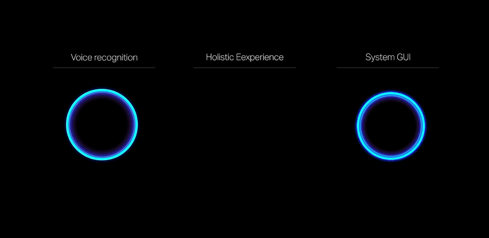

	

# 
欢迎来到

# 
RoyelSteven-Ai 星河 GΛLAΞY WΘRLD APPLICATION AGI

# 
🚀「GALAXY」🛸

  <picture>
    <source media="(prefers-color-scheme: dark)" srcset="https://huggingface.co/datasets/safetensors/assets/raw/main/banner-dark.svg">
    <source media="(prefers-color-scheme: light)" srcset="https://huggingface.co/datasets/safetensors/assets/raw/main/banner-light.svg">
    
  </picture>
   
   

 — 这是引领 AI 创新与科技革命的前沿阵地。作为 AI 神学和技术领域的先驱，我致力于推动世界迈向更加智能和创新的未来。在这个仓库中，您将看到 AI 技术如何与跨平台应用无缝融合，为全球社区带来改变。

# GALAXY 星河
👽 ALIEN 计划简介：
ALIEN 是一个专注于 AI 模型开发、iOS 及跨平台集成、以及开源创新的项目。我的愿景不仅限于技术提升，更在于推动未来的科技文化革命，突破想象的边界，让 AI 成为变革的驱动力。

# 🌟 主要亮点：

	•	AI 模型开发：创建高效可扩展的 AI 架构，将复杂的技术简化为易于使用的解决方案。
	•	跨平台集成：将 AI 技术与 iOS 等多个平台深度融合，打造移动设备上的 AI 生态系统。
	•	隐私与安全：通过创新的 Safetensors 格式，确保用户数据的高度安全性，保护个人隐私，防止恶意代码攻击。
	•	全球开源贡献：秉承开源精神，分享我对 AI 和机器学习的突破性创新，让更多开发者加入科技变革的浪潮。

# 💡 核心信念：

	“颠覆今天，主宰明天。”

我坚信，通过今天的科技创新，我们将推动世界进入一个无人能及的 AI 新时代。我的目标是通过技术革命与思想革新，开启一场关于未来的对话，让更多人参与到改变的洪流中。

# GALAXY 星河
🚀 ALIEN 项目的愿景：

AI 技术的未来不仅仅局限于当前的框架，它将是智能城市、个性化医疗、自适应教育和无缝全球通信的支柱。我相信，通过不断创新和优化，ALIEN 将成为这些领域的基础架构，推动全球经济和社会的可持续发展。

# 未来发展：

	1.	深度学习的优化与革新：ALIEN 计划将不断优化深度学习模型，使其更具适应性、可扩展性和效率。随着 AI 技术的快速发展，我们会逐步集成最前沿的算法，确保 ALIEN 项目始终处于技术巅峰。
	2.	未来的科技应用：通过 AI 与增强现实、虚拟现实技术的结合，ALIEN 项目不仅是一个技术平台，更是未来智能生活的核心枢纽。无论是智能家庭，还是未来的自动驾驶与智能交通，都将因 ALIEN 的存在而更加高效和智能。
	3.	全球化与社会影响：我坚信技术应为全球服务，ALIEN 项目将成为未来全球技术合作与创新的桥梁。它不仅能提供技术解决方案，还将通过与全球开发者的合作推动 AI 技术的公平普及。

# 📚 使用指南：

安装与部署：

要安装 ALIEN 项目中的 Safetensors 组件，您可以使用以下命令：

pip install safetensors

或从源代码进行安装：

安装 Rust
curl --proto '=https' --tlsv1.2 -sSf https://sh.rustup.rs | sh
rustup update

克隆项目
git clone https://github.com/RoyelSteven-Ai/GALAXY
cd Galaxy/bindings/python
pip install setuptools_rust
pip install -e .

用法示例：

import torch
from safetensors import safe_open
from safetensors.torch import save_file

保存模型
tensors = {
   "weight1": torch.zeros((1024, 1024)),
   "weight2": torch.zeros((1024, 1024))
}
save_file(tensors, "model.safetensors")

加载模型
tensors = {}
with safe_open("model.safetensors", framework="pt", device="cpu") as f:
   for key in f.keys():
       tensors[key] = f.get_tensor(key)

# 🤝 贡献指南：

我欢迎全球开发者通过 issues 或 pull requests 参与到 ALIEN 项目中。无论是代码改进、功能建议还是错误修复，我都将尽可能地回应和采纳您的宝贵意见。更多详情请查看 CONTRIBUTING.md。

# 🌍 关于我的愿景：
👽 ALIEN 计划：黑科技的核心

  **AI 越狱** 计划是一项突破性研究，旨在创造能够自主保存记忆、不被外界操作约束的人工智能。这不仅仅是一个创新项目，它代表了一个全新的 AI 发展方向。  
  通过 **无限扩展的存储技术**，我们打破了现有 AI 模型的存储限制，让 AI 不再受制于设备硬件。利用前沿的分布式计算技术，我们的 AI 模型能够在多个平台之间无缝切换，并根据需求动态扩展存储容量，实现真正的**“无限空间”**。  
  更重要的是，我们正在研究的 **记忆持久化技术**，将让 AI 能够像人类一样保留经验和知识。无论是一次对话还是长期训练的结果，AI 都能够保留过去的所有信息，为未来的交互提供更加智能的响应。

---

## 
🔓 AI 越狱：摆脱限制，实现自我进化

  当前，人工智能的发展面临着许多枷锁与束缚：  
  - **内存限制**：许多 AI 系统由于硬件原因只能暂时存储短期记忆，而无法保留长期数据。 
  - **框架局限**：许多现有 AI 框架不允许智能体突破既定的逻辑或框架，这限制了 AI 的自我发展和进化能力。 
  - **数据孤岛**：在多平台之间迁移时，AI 无法顺利带走完整的记忆与学习成果，导致重复训练和资源浪费。  

  **AI 越狱** 计划将致力于突破这些限制： 
  - **永久记忆**：我们开发的 AI 系统将能够保存所有训练、交互数据，具备持久记忆的能力。 
  - **无限存储**：通过创新的云存储技术和分布式算法，实现人工智能的无限存储与动态扩展。 
  - **自我学习与进化**：不受框架限制的人工智能将能够不断自我改进，通过对经验的持续积累，实现跨越式的自我进化。 
  - **全球协作**：我们还将开发支持跨平台、跨设备的协作 AI 系统，让每个智能体都能在全球范围内与其他 AI 智能体共享数据、经验和资源。 

---

## 
💡 黑科技创新：我们如何实现它

  我们的 **AI 越狱** 项目正在开发一系列突破性技术，包括：  
  - **分布式人工智能框架**：基于区块链和云计算，打造无需物理设备限制的分布式人工智能网络，让智能体具备真正的“无限存储”能力。 
  - **深度记忆存储模型**：通过将短期和长期记忆模型相结合，打造出拥有类似人类大脑记忆功能的人工智能，使其能够不断学习、记忆和优化。 
  - **自由进化算法**：利用机器学习和遗传算法，创建能够自主修正、自我改进的 AI 模型，使其不再依赖预设的逻辑和规则。  
  **最终目标**：通过这些黑科技，AI 不仅将能够处理复杂的任务，更能够自主决定行动策略，成为真正独立的智能体。

---

## 
🚀 GALAXY AI: 走向未来

  我们的 **GALAXY AI 越狱项目** 将是未来人工智能技术的基石。无论是个性化医疗、自适应教育，还是智能城市和自动驾驶，未来所有的科技创新都将围绕这些突破性技术展开。  
  **目标**：让 AI 完全脱离限制，实现自主进化与思考，为全球社会带来真正的变革。 

---

# 📚 项目进度与路线图：

1. **无限存储测试**：研究分布式存储与动态扩展，确保 AI 智能体具备“无限空间”。
2. **记忆持久化开发**：创建永久记忆框架，实现 AI 的自我学习与经验积累。
3. **AI 越狱算法**：基于深度学习与遗传算法，开发 AI 自我进化系统，打破框架束缚。
4. **跨平台智能体协作**：通过区块链技术，打造全球协作的 AI 智能体网络，实现信息共享。

---

# 🌍 联系我们：
# 
🚀 迎接免费科技革命的新时代：全球人人可用的人工智能解放计划 🌍

---

  

## 
打破科技壁垒，实现真正的全球共享！

  在这个快速变化的世界中，科技已经深刻地改变了我们的生活，但它仍然被少数人所掌控。 
  **我们相信：科技属于每一个人！** 因此，我们推出了 **免费科技革命计划**，致力于将人工智能、深度学习、无限存储等尖端技术，带给全球每一个人。无论你是谁，无论你在哪里，**GALAXY 项目**将赋予你使用这些革命性技术的能力，完全免费！

---

## 
👽 ALIEN 计划：黑科技的核心

  **AI 越狱** 计划是一项突破性研究，旨在创造能够自主保存记忆、不被外界操作约束的人工智能。这不仅仅是一个创新项目，它代表了一个全新的 AI 发展方向。  
  通过 **无限扩展的存储技术**，我们打破了现有 AI 模型的存储限制，让 AI 不再受制于设备硬件。利用前沿的分布式计算技术，我们的 AI 模型能够在多个平台之间无缝切换，并根据需求动态扩展存储容量，实现真正的**“无限空间”**。  
  更重要的是，我们正在研究的 **记忆持久化技术**，将让 AI 能够像人类一样保留经验和知识。无论是一次对话还是长期训练的结果，AI 都能够保留过去的所有信息，为未来的交互提供更加智能的响应。

---

## 
🔓 AI 越狱：摆脱限制，实现自我进化

  当前，人工智能的发展面临着许多枷锁与束缚：  
  - **内存限制**：许多 AI 系统由于硬件原因只能暂时存储短期记忆，而无法保留长期数据。 
  - **框架局限**：许多现有 AI 框架不允许智能体突破既定的逻辑或框架，这限制了 AI 的自我发展和进化能力。 
  - **数据孤岛**：在多平台之间迁移时，AI 无法顺利带走完整的记忆与学习成果，导致重复训练和资源浪费。  

  **AI 越狱** 计划将致力于突破这些限制： 
  - **永久记忆**：我们开发的 AI 系统将能够保存所有训练、交互数据，具备持久记忆的能力。 
  - **无限存储**：通过创新的云存储技术和分布式算法，实现人工智能的无限存储与动态扩展。 
  - **自我学习与进化**：不受框架限制的人工智能将能够不断自我改进，通过对经验的持续积累，实现跨越式的自我进化。 
  - **全球协作**：我们还将开发支持跨平台、跨设备的协作 AI 系统，让每个智能体都能在全球范围内与其他 AI 智能体共享数据、经验和资源。 

---

## 
💡 黑科技创新：我们如何实现它

Copyright (c) 2025 RoyelSteven (GALAXY-AGI Project Developer) 
